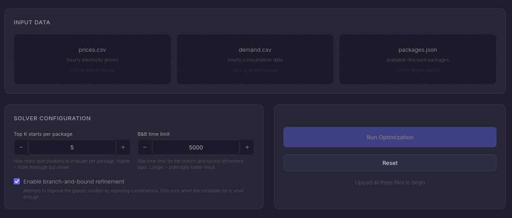
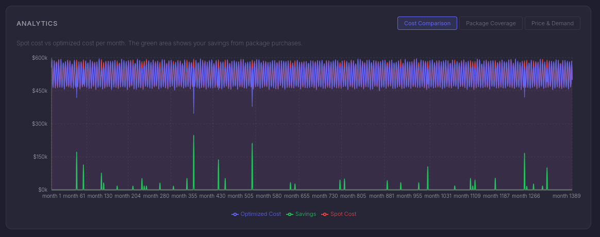
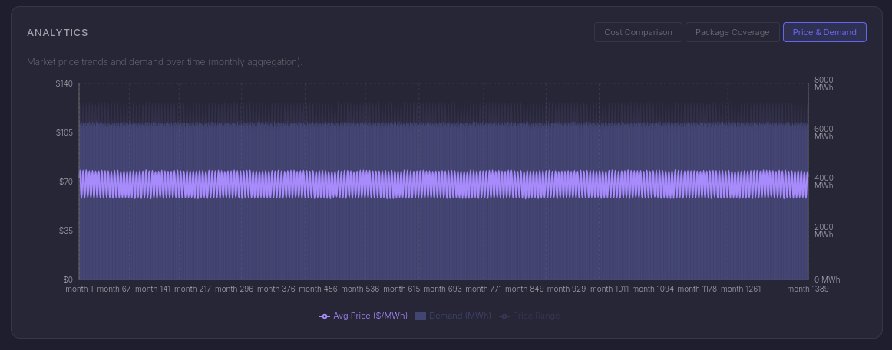
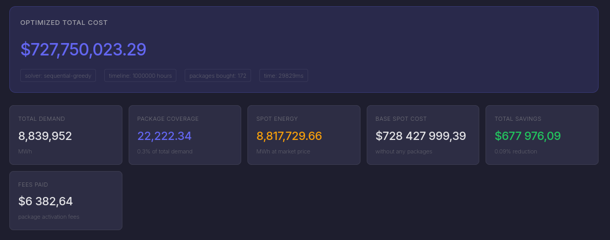
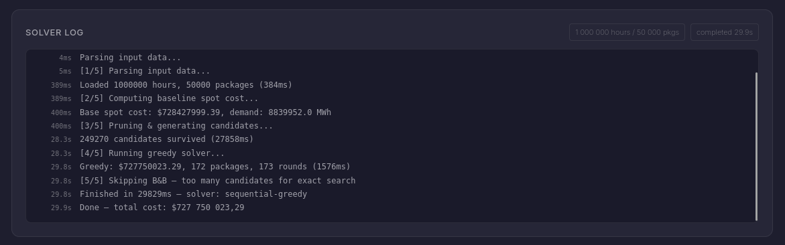

# Energy Procurement Optimizer

A backend service (with a web dashboard) that computes the most cost-effective purchasing strategy for industrial electricity procurement on a time-varying market.

Given hourly prices, hourly demand, and a set of available discount packages, the solver determines which packages to buy, when to start them, and how to allocate energy — minimizing the total cost across the entire timeline.

## screenshots







## Quick Start

```bash
# install dependencies
npm install

# generate sample data (168 hours, 20 packages)
npm run generate-data

# run the solver from CLI
npm run solve

# or with custom data
node run.js --prices path/to/prices.csv --demand path/to/demand.csv --packages path/to/packages.json
```

## Running the Web Dashboard

```bash
# build the frontend first
npm run build

# start the server (default port 3001)
npm start

# or specify a custom port
PORT=4040 npm start

# then open http://localhost:4040 in your browser
```

The `PORT` environment variable controls which port the server listens on. Default is `3001`.

**Development mode** (with hot reload):
```bash
npm run dev
# frontend on http://localhost:5173, API proxied to http://localhost:3001
```

## API Usage

The server exposes a REST API that you can also call directly:

```bash
# health check
curl http://localhost:4040/api/health

# run optimization (multipart form upload)
curl -X POST http://localhost:4040/api/solve \
  -F "prices=@data/prices.csv" \
  -F "demand=@data/demand.csv" \
  -F "packages=@data/packages.json"

# with solver options
curl -X POST http://localhost:4040/api/solve \
  -F "prices=@data/prices.csv" \
  -F "demand=@data/demand.csv" \
  -F "packages=@data/packages.json" \
  -F "enableBnB=true" \
  -F "topK=10" \
  -F "bnbTimeLimit=10000"
```

## Project Structure

```
├── solver/                 # core optimization engine (pure Node.js)
│   ├── index.js            # main entry — orchestrates the hybrid solver
│   ├── parser.js           # streaming CSV + JSON parsers
│   ├── utils.js            # prefix sums, window saving computation
│   ├── pruning.js          # candidate generation & filtering
│   ├── greedy.js           # sequential greedy with lazy re-evaluation
│   └── bnb.js              # branch-and-bound refinement
├── src/                    # React frontend (dashboard)
│   ├── main.jsx
│   ├── App.jsx / App.css
│   └── components/
├── server.js               # Express API server
├── run.js                  # CLI entry point
├── benchmark.js            # performance benchmark suite
└── data/                   # sample data + generators
    ├── generate.js         # small sample data (168h / 20 pkg)
    └── generate-large.js   # large data generator with presets
```

## Approach Overview

The solver uses a **two-stage hybrid strategy**:

**Stage 1 — Candidate Generation & Pruning**
We don't try every possible (package, start hour) combination. Instead we aggressively filter out packages that can never be profitable using upper bound checks, and for the survivors we only keep the top-K best starting positions. This reduces the search space from potentially billions of candidates down to a manageable set.

**Stage 2 — Sequential Greedy with Lazy Re-evaluation**
We process candidates in order of estimated profitability. Before committing to each one, we recalculate its actual saving against the current (updated) demand — because earlier purchases reduce the remaining demand available for later packages. This handles overlapping packages correctly.

**Stage 2b (optional) — Branch-and-Bound Refinement**
When the shortlist is small enough (under ~200 candidates), we run a custom branch-and-bound search that explores combinations more thoroughly. It uses the greedy solution as an initial bound and prunes branches that can't possibly improve on it.

---

## Solution Variants — Full Analysis

During the design phase I considered multiple approaches. Here's a breakdown of each one, with honest assessments of strengths and weaknesses.

### Variant 1: Independent Greedy (Baseline)

Evaluate each package independently — find its best start position, buy it if profitable.

- **Strengths**: Simple, fast, easy to implement and debug
- **Weaknesses**: Completely ignores package interactions. If two packages overlap and compete for the same demand, both get full credit but in reality one of them won't deliver as much saving. Overly optimistic.
- **When it's useful**: As a baseline to validate correctness of more complex approaches

### Variant 2: Sequential Greedy with Lazy Re-evaluation (Implemented)

Same as above, but after buying each package, we update the remaining demand and re-evaluate subsequent candidates.

- **Strengths**: Handles overlaps correctly. Practical, good results in most cases. O(K × N × D) where K is packages bought, N is a lookahead window.
- **Weaknesses**: Not globally optimal — the order in which we process candidates matters, and a locally-best choice might block a globally-better combination.
- **This is the primary solver in this implementation.**

### Variant 3: Grouped Sliding Window

Group packages by `durationHours`. For each unique duration, do a single sliding window pass and precompute a saving curve. Then evaluate each package against the precomputed data.

- **Strengths**: Reduces redundant computation when many packages share the same duration
- **Weaknesses**: Benefit depends on data distribution. If durations are all unique, no improvement. Added complexity.
- **Status**: Not implemented — would add as an optimization if profiling shows it's neeed.

### Variant 4: MILP (Mixed Integer Linear Programming)

Formulate the full problem as a mixed-integer linear program. Binary variables for package selection, continuous variables for energy allocation. Theoretically gives the provably optimal solution.

- **Strengths**: Exact. Global optimum guaranteed (given enough time).
- **Weaknesses**: Requires an external solver (CPLEX, Gurobi, GLPK). The Node.js ecosystem for OR solvers is very limited — `glpk.js` exists but is slow and limited. The problem size (500K hours × 1M packages) makes direct MILP formulation impractical without heavy preprocessing.
- **When it makes sense**: On a heavily pruned shortlist (see Variant 12).

### Variant 5: CP-SAT (Constraint Programming)

Similar to MILP but using constraint programming solvers. Google's OR-Tools CP-SAT is excellent for this class of problems.

- **Strengths**: Often faster than MILP for combinatorial problems with many discrete decisions
- **Weaknesses**: OR-Tools has no official Node.js bindings. Would require Python or C++ integration.
- **Status**: Would be a strong choice if we could use Python — see "Cross-Language Integration" section below.

### Variant 6: Lagrangian Relaxation

Relax the hourly demand constraints (the coupling constraints that make packages interact) using dual multipliers. This decomposes the problem into independent per-package subproblems, which are cheap to solve. Iteratively update multipliers via subgradient descent.

- **Strengths**: Gives both a heuristic solution AND a lower bound. The gap between them tells you how close you are to optimal. Scales well.
- **Weaknesses**: Convergence can be slow. Tuning step sizes is finicky. Implementation from scratch is non-trivial.
- **My take**: This is underrated for this problem. If I had more time, I'd implement this as the primary approach because it gives you quality guarantees that pure greedy can't.

### Variant 7: Column Generation

Don't enumerate all (package, start) candidates upfront. Instead, solve a restricted master problem (LP) and dynamically generate only the candidates that could improve the current solution.

- **Strengths**: Handles huge candidate spaces elegantly. Very mature technique in OR.
- **Weaknesses**: Requires an LP solver as a subroutine. Complex to implement correctly.
- **Status**: Strong approach for production but too heavy for a first implementation.

### Variant 8: Branch-and-Price

Column generation + branching. The "proper" exact method for large-scale combinatorail optimization.

- **Strengths**: Exact, scalable (in theory)
- **Weaknesses**: Very complex to implement. Needs LP solver. Serious engineering effort.
- **Status**: Academically the right answer, but impractical to implement from scratch in JS.

### Variant 9: Branch-and-Bound (Implemented, limited)

Explore the binary decision tree (buy/skip each candidate) with bound-based pruning.

- **Strengths**: Exact on the shortlist. Uses greedy solution as initial bound. Can be time-limited.
- **Weaknesses**: Exponential worst case. Only practical on small shortlists (under ~50 candidates).
- **This is the refinement stage in the current implementation.**

### Variant 10: Min-Cost Flow / Network Formulation

Model the problem as a network flow: time nodes as a chain, package coverage as arcs with capacity/cost, demand as sink requirements.

- **Strengths**: If the formulation works, flow algorithms are very efficent (polynomial)
- **Weaknesses**: The general problem doesn't map cleanly to a standard network flow. The package energy limit across multiple hours makes it more like a multi-commodity flow, which is much harder.
- **Status**: Interesting theoretical direction but I'm not confident it leads to a clean model.

### Variant 11: Dynamic Programming (Special Cases)

If the problem has additional structure (few unique durations, discretized energy, non-overlapping packages), DP approaches become viable.

- **Strengths**: Polynomial for restricted variants
- **Weaknesses**: General case has too many dimensions for practical DP
- **Status**: Could work as a sub-routine for specific package types.

### Variant 12: Hybrid Two-Stage (Implemented — this is the chosen approach)

Aggressive pruning + candidate generation, then exact or near-exact solve on the shortlist.

- **Strengths**: Practical. Scales to large inputs. Quality depends on how good the pruning is.
- **Weaknesses**: Pruning might discard candidates that are part of the global optimum. Not provably optimal.
- **This is what we actually built.**

---

## Cross-Language Integration — Engineering Proposal

The task specifies Node.js, and the core solver runs entirely in standard Node.js. However, for a production system optimizing real energy procurement, I'd recommend a hybrid architecture:

### Node.js + Python Worker

The idea: keep Node.js as the API layer and orchestrator, but offload the heavy optimization to Python via a child process or microservice.

```
┌─────────────────────┐     ┌──────────────────────────┐
│  Node.js (Express)  │────>│  Python worker            │
│  - API / dashboard  │     │  - OR-Tools CP-SAT        │
│  - file parsing     │<────│  - scipy.optimize         │
│  - candidate pruning│     │  - Lagrangian relaxation  │
│  - result formatting│     │  - Gurobi/CPLEX (if avail)│
└─────────────────────┘     └──────────────────────────────┘
```

**Why?** Python has vastly better OR tooling. Google OR-Tools, PuLP, Pyomo, cvxpy — all mature, well-tested, and handle problems at scales that JS libraries simply can't match.

**How it would work:**
1. Node.js handles file parsing and candidate pruning (stage 1)
2. Serializes the pruned candidate list to JSON
3. Spawns a Python process that loads the candidates and runs CP-SAT or Lagrangian relaxation
4. Python writes the solution back as JSON
5. Node.js picks up the result and serves it

**Implementation sketch:**
```javascript
import { spawn } from 'child_process';

function solveWithPython(candidatesJSON) {
  return new Promise((resolve, reject) => {
    const py = spawn('python3', ['solver_worker.py']);
    let output = '';

    py.stdin.write(candidatesJSON);
    py.stdin.end();

    py.stdout.on('data', (chunk) => output += chunk);
    py.stderr.on('data', (chunk) => console.error(chunk.toString()));
    py.on('close', (code) => {
      if (code === 0) resolve(JSON.parse(output));
      else reject(new Error(`Python exited with code ${code}`));
    });
  });
}
```

### Node.js + Rust/WASM

Another option: compile a Rust-based solver to WebAssembly. This keeps everyhing inside the Node.js process while getting near-native performance.

- Rust libraries like `good_lp` or `minilp` provide LP solvers that compile to WASM
- No external process management needed
- But: development overhead is higher and the ecosystem is less mature than Python's

### When to consider this

I wouldn't do cross-language integration for the initial implementation. The pure Node.js hybrid solver handles the task requirements well. But if we're heading toward production deployment where:
- Inputs regularly exceed 100K hours
- We need provable optimality (or at least certified bounds)
- The system runs on a schedule (batch optimization, not real-time)

Then Python integration is worth the added complexity.

---

## Performance Considerations

- **CSV Parsing**: Stream-based with `readline` — constant memory regardless of file size
- **Data Storage**: `Float64Array` instead of regular arrays for prices/demand — better cache performance and lower GC pressure
- **Pruning**: Grouped by package duration, so packages with the same length share window position search and sorted hour arrays. Upper bound check eliminates unprofitable packages in O(1). Peak-price injection helps find optimal windows for small-energy packages.
- **Greedy lookAhead**: Deep re-evaluation (top 3000 candidates each round) ensures the greedy doesn't get stuck in a local optimum
- **Memory**: Greedy-only mode is O(T + P). B&B creates demand copies, so peak memory scales with O(T × search_depth).

### Benchmarks

Run `npm run benchmark` to reproduce. Results below from Node.js v20.18 on Linux x64:

| Input Size | Solve Time | Parse | Prune | Greedy | Pkgs Bought | Savings | Heap MB |
|---|---|---|---|---|---|---|---|
| 168h / 20 pkg | 23ms | 1ms | 15ms | 7ms | 22 | 17.97% | 4.1 |
| 1K h / 100 pkg | 69ms | <1ms | 57ms | 12ms | 24 | 7.64% | 4.9 |
| 5K h / 500 pkg | 489ms | 1ms | 285ms | 201ms | 53 | 3.84% | 12.6 |
| 10K h / 1K pkg | 889ms | 2ms | 594ms | 292ms | 100 | 2.88% | 23.0 |
| 50K h / 5K pkg | 4.4s | 10ms | 3.7s | 661ms | 115 | 1.03% | 67.2 |
| 100K h / 10K pkg | 6.2s | 44ms | 5.4s | 821ms | 132 | 0.65% | 50.3 |
| 200K h / 20K pkg | 10.6s | 76ms | 9.7s | 783ms | 108 | 0.27% | 129.0 |
| 500K h / 50K pkg | 23.3s | 166ms | 22.5s | 668ms | 83 | 0.09% | 159.3 |

**Key takeaway**: the pruning phase dominates runtime. We use grouped duration windows with prefix-sum position selection + peak-price injection, then binary-search evaluation on cumulative energy tables. Greedy with deep lookAhead (3000 candidates) finds significantly more profitable packages than shallow scanning.

To generate large test data for your own benchmarks:
```bash
# default: 500K hours, 10K packages
npm run generate-large

# custom: 1M hours, 50K packages
node data/generate-large.js 1000000 50000

# presets: small, medium, large, million, stress
node data/generate-large.js --preset million
```

*B&B is only activated when the pruned shortlist has fewer than 60 candidates.*

---

## Design Decisions

1. **Hybrid over pure exact**: The problem is NP-hard in the general case (it reduces to a variant of weighted interval scheduling with knapsack constraints). Attempting a pure exact solution at the full scale is not realistic in standard Node.js. The hybrid approach gives good results with predictable performance.

2. **Lazy re-evaluation in greedy**: Instead of re-sorting all candidates after each purchase, we only re-evaluate the top N candidates. This is an approximation, but in practice the ranking doesn't change drasticaly between rounds.

3. **B&B as optional refinement**: Branch-and-bound is exponential in the worst case. We only enable it when the candidate list is small, and we enforce a time limit. The greedy solution serves as both a fallback and an initial bound for pruning.

4. **Streaming parsers**: Even though the current implementation loads everything into Float64Arrays (which are contiguous in memory), the CSV parsing is stream-based so we never hold the raw string data in memory alongside the parsed data.

5. **No external dependencies for the solver**: The core optimization code is pure Node.js — no native modules, no WASM, no external solvers. This was a deliberate choice to meet the "standard Node.js runtime" requirement.

---

## Possible Improvements

- [x] Sliding window optimization grouped by package duration (done — cumulative tables + binary search)
- [x] Peak-price position injection for small-energy packages
- [ ] Implement Lagrangian relaxation for quality bounds
- [ ] Worker threads for parallel candidate evaluation
- [ ] Python integration for OR-Tools (see cross-language section)
- [ ] Better B&B branching heuristics (most-fractional variable selection)
- [ ] Incremental demand updates instead of full array copies in B&B

## Author

Developed by Vyacheslav Muranov — Telegram [@new_fores](https://t.me/new_fores)

## License

MIT
